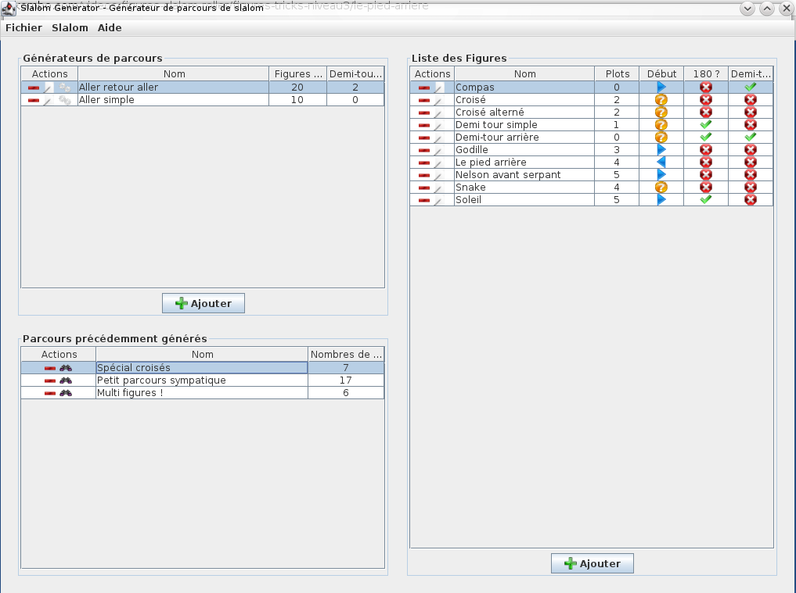

# SLALOM GENERATOR

__Slalom Generator__ is small java tools (cross platform) to generate _Slalom Sequences_ .

Indicate figures you know, number of plot, and expected desired number of figures and generate a coherent sequence !

---------------

# User manual

## How to install this tools ?

1. Download it on [https://sourceforge.net/projects/slalomgenerator/files/latest/download?source=files](https://sourceforge.net/projects/slalomgenerator/files/latest/download?source=files)
1. Unzip file where you want to install it
1. Launch (click) on __SlalomGenerator.jar__

## How to use ?

### UI layout
UI interface is divided into 3 parts :

- _Right part_ : save figures which you know
- _Top left part_ : define parameters to generate sequence
- _Botom left part : show your generated sequences

### Figures

To add figure, click on _add_ bottom the left part, or 
> Slalom > Create new figure

Figures have some properties :

- _Name_ and _Description_ are used to identify figure
- _Plot_ is number of plots covered by figure, can be null or negative if figure turn back
- _Begin : define what direction (forward or in reverse) slalomer must have to start this figure. Can be inconsequential...
- _180 ?_ : define if slalomer direction will be reversed
- _Half-turn_ : after this figure, slalomer return back to start point

### Generators

To add figure, click on _add_ on middle of right part, or 
> Slalom > Create new generator

Generator parameters are :

- _Name_ to identify itself
- _Plot_ : size (in plots) of line
- _Half-turn_ : number of half-turn in sequence
- _Turn before_ : generator insert half-turn when this plot number remain ahead
- _Max figures_ : finish sequence when it have this number of figures

To generate sequence click on gear icon, on generator you choose.  
  
---------------

# Developers

## License

This tools is publish under [creative license](http://creativecommons.org/licenses/by/3.0/).

## Bug tracking / Improvement requests

You can ask me for improvement or submit me issues on [GitHub page project][gh].

## Improvements 

Be free to checkout sources and request me for pull. You need _Maven_ but you can use editor of your choice (_Eclipse_, ...).

First get it on [GitHub][GH] :

> git clone https://github.com/TomDush/SlalomGenerator.git

then, compile with :

> mvn clean package  

[gh]: (https://github.com/TomDush/SlalomGenerator)